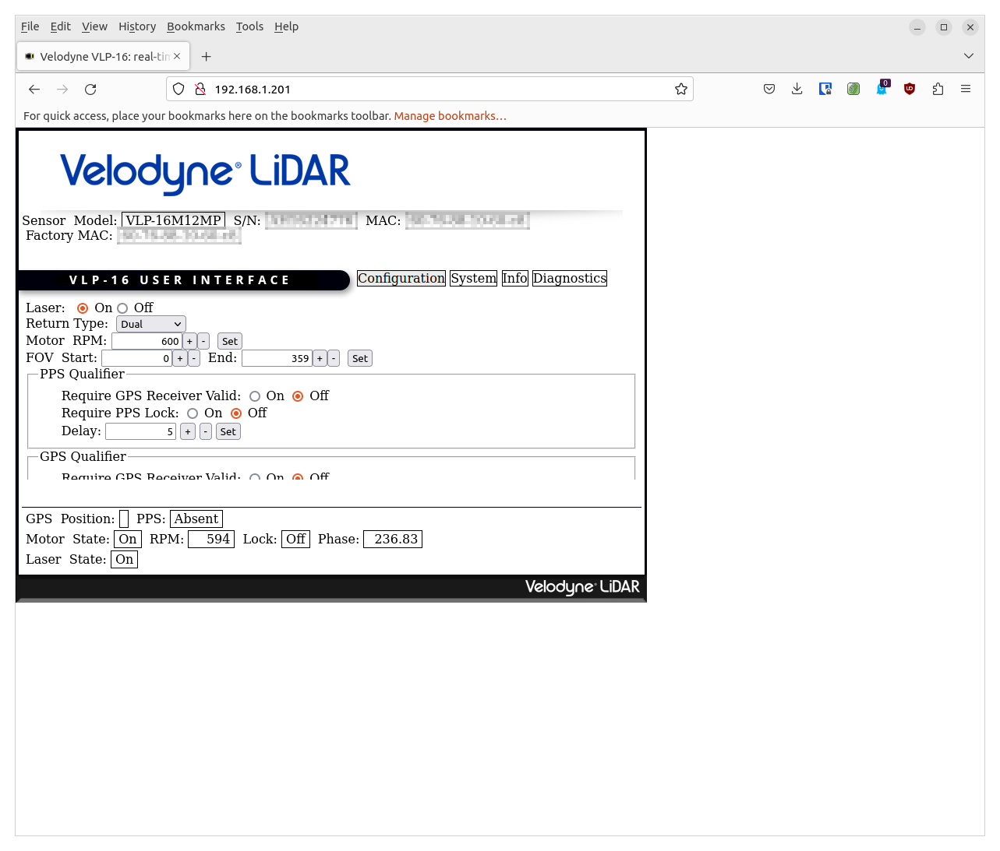
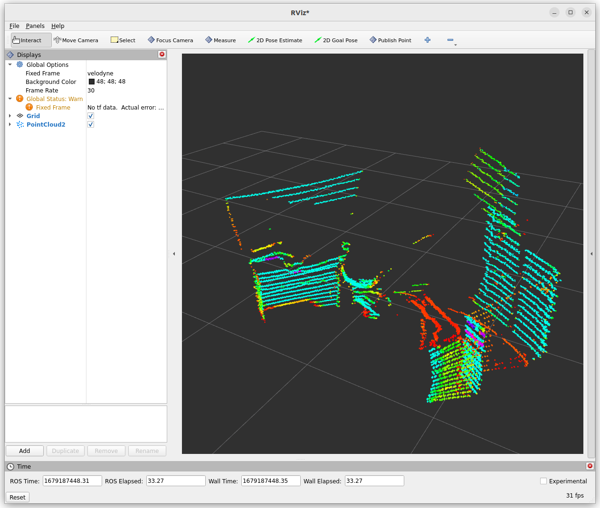

# Docker for Velodyne 3D lidars on ROS 2

Author: [Tobit Flatscher](https://github.com/2b-t) (June 2022 - March 2023)

[](https://github.com/2b-t/velodyne-ros2-docker/actions/workflows/build.yml) [](https://opensource.org/licenses/MIT)


## 0. Overview
This repository contains a Dockerfile and all the documentation required to launch a [Velodyne 3D lidar](https://velodynelidar.com/surround-lidar/) such as the VLP-16 or VLP-32 with the [Robot Operating System ROS 2](https://docs.ros.org/en/humble/index.html).

## 1. Preparing

The Velodyne lidars are common in two different versions, with an **interface box** or with an **8-pin M12 connector** only. The ones with interface boxes are generally quite expensive on the second-hand market while the ones with M12 connector often go comparably cheap.

|  |  |
| ------------------------------------------------------------ | ------------------------------------------------------------ |
| Velodyne VLP-16 with interface box                           | Male 8-pin M12 connector                                     |

The interface box already comes with an overcurrent protection and gives you access to an Ethernet port as well as a power connector. For the 8-pin power connector on the other hand you will have to create your own cable. This can though be done with comparably little effort as shown below.

### 1.1 Creating your own cable

If you got yourself a lidar without the interface box - only with the M12 connector - you will have to make a cable for it yourself. Fortunately enough this can be done without any soldering. The pin-out for this can be found in the [offical data sheet](https://pdf.directindustry.com/pdf/velodynelidar/vlp-16-datasheets/182407-676097.html).

Get yourself a cheap 12V 1A power supply such as this [Zolt 45W](https://www.amazon.co.uk/dp/B08NBWHKGG?psc=1&ref=ppx_yo2ov_dt_b_product_details), a corresponding [pigtail power cable](https://www.amazon.co.uk/dp/B08JKQ3PF9?psc=1&ref=ppx_yo2ov_dt_b_product_details) (in this case positive center), an [Ethernet network cable](https://www.amazon.co.uk/gp/product/B00DZJNO4M/ref=ox_sc_saved_image_1?smid=A3GL1BA201XJVN&psc=1) and a [female 8-pin M12 connector](https://www.aliexpress.com/item/32839854023.html) (see pictures below).

|  |  |  |  |
| ------------------------------------------------------------ | ------------------------------------------------------------ | ------------------------------------------------------------ | ------------------------------------------------------------ |
| 12V 1A power supply                                          | Pigtail 5.5mm x 2.1mm power cable                            | Ethernet network cable                                       | Female 8-pin M12 connector                                   |

The Ethernet cable will likely be T-568 B (see image below):


The female 8-pin M12 connector should already be numbered on the front. In case it is not please check the [offical data sheet](https://pdf.directindustry.com/pdf/velodynelidar/vlp-16-datasheets/182407-676097.html) keeping in mind that the side depicted is the male sensor-side while you are interested in the matching mirrored female client-side. In case you mess this up you might fatally damage your lidar! You will have to connect the pins as follows:

| 8-pin connector pin number | Wire                         | Signal       |
| -------------------------- | ---------------------------- | ------------ |
| 1                          | Ethernet T-568B green        | Ethernet RX- |
| 2                          | Ethernet T-568B light-green  | Ethernet RX+ |
| 3                          | Ethernet T-568B orange       | Ethernet TX- |
| 4                          | Ethernet T-568B light-orange | Ethernet TX+ |
| 5                          | -                            | -            |
| 6                          | -                            | -            |
| 7                          | Power cable white            | +12V         |
| 8                          | Power cable black            | Ground       |

## 2. Configuring
The set-up is similar to the Velodyne [VLP-16](http://wiki.ros.org/velodyne/Tutorials/Getting%20Started%20with%20the%20Velodyne%20VLP16) and the [HDL-32E](http://wiki.ros.org/velodyne/Tutorials/Getting%20Started%20with%20the%20HDL-32E) lidar in ROS. As a first step we will have to **find out which network interface your lidar is connected to**. For this launch the following command 

```bash
$ for d in /sys/class/net/*; do echo "$(basename ${d}): $(cat $d/{carrier,operstate} | tr '\n' ' ')"; done
```

This will output a list of the available interfaces as well as their connection status:

```bash
br-af62670dc1bb: 0 down 
br-eabc8a210172: 0 down 
docker0: 0 down 
eno1: 0 down 
lo: 1 unknown 
wlx9ca2f491591b: 1 up 
```

Now plug-in the lidar and the corresponding network interface (should start in `en*` due to the [network interface naming convention](https://man7.org/linux/man-pages/man7/systemd.net-naming-scheme.7.html)) should change to `up` when launching the same command again:

```bash
br-af62670dc1bb: 0 down 
br-eabc8a210172: 0 down 
docker0: 0 down 
eno1: 1 up 
lo: 1 unknown 
wlx9ca2f491591b: 1 up 
```

This network interfaces corresponds to the device with the MAC-address

```bash
$ cat /sys/class/net/eno1/address
AB:12:c3:45:67:8a
```

Now you can [follow the ROS guide to configure your IP address on the host computer](http://wiki.ros.org/velodyne/Tutorials/Getting%20Started%20with%20the%20Velodyne%20VLP16#Configure_your_computer.2BIBk-s_IP_address_through_the_Gnome_interface) for the corresponding network interface (or alternatively follow the [Ubuntu Net Manual](https://help.ubuntu.com/stable/ubuntu-help/net-manual.html.en)) where the configuration is performed via the graphic menu or continue with the following paragraph that performs the same set-up through the command line. Be sure to replace `eno1` with your network interface in the commands below!

Let us check the available connections with `nmcli`:

```bash
$ nmcli connection show
```

Assign yourself the IP address `192.168.1.100`. Feel free to replace `100` with any number between `1` and `254` apart from the one the Velodyne is configured to (`201` by default).

```bash
$ nmcli connection add con-name velodyne-con ifname eno1 type ethernet ip4 192.168.1.100/24
```

Now let's inspect the connection with.

```bash
$ nmcli connection show velodyne-con
```

Let's bring up the connection with the following command:

```bash
$ nmcli connection up id velodyne-con
```

Let's show the IP address of our device:

```bash
$ ip address show dev eno1
```

[Temporarily configure yourself an IP address](https://ubuntu.com/server/docs/network-configuration) in the `192.168.3.X` range:

```bash
$ sudo ip addr add 192.168.3.100 dev eno1
```

Set up a temporary route to the Velodyne. In case a different address was configured for the Velodyne replace the address below by its address.

```bash
$ sudo route add 192.168.1.201 dev eno1
```

```bash
$ ip route show dev eno1
```

Now you should be able to open the webpage [http://192.168.1.201](http://192.168.1.201) and change the configuration for your Velodyne.



Inside your Dockerfile make sure to use the `network_mode` `host` option:

```yaml
    network_mode: "host"
```

## 3. Launching
Allow the container to display contents on your host machine by typing

```bash
$ xhost +local:root
```

Then build the Docker container with

```shell
$ docker compose -f docker-compose-gui.yml build
```
or directly with the [`devcontainer` in Visual Studio Code](https://code.visualstudio.com/docs/devcontainers/containers). For Nvidia graphic cards the file `docker-compose-gui-nvidia.yml` in combination with the [`nvidia-container-runtime`](https://nvidia.github.io/nvidia-container-runtime/) has to be used instead.
After it is done building **connect the Velodyne lidar**, start the container

```shell
$ docker compose -f docker-compose-gui.yml up
```
and launch the [corresponding **Velodyne Pointcloud launch file**](https://github.com/ros-drivers/velodyne/tree/ros2/velodyne_pointcloud/launch). For the VLP-16:
```shell
$ source /opt/ros/humble/setup.bash
$ ros2 launch velodyne velodyne-all-nodes-VLP16-launch.py
```
Make sure that the nodes have started correctly with

```bash
$ ros2 node list
```

and check if the topics are published correctly with

```shell
$ ros2 topic list
```
in combination with

```shell
$ ros2 topic info <topic_name>
```

Finally **visualize the points with Rviz** by launching

```shell
$ ros2 run rviz2 rviz2 -f velodyne
```
in another terminal and display the topics published by the Velodyne.


