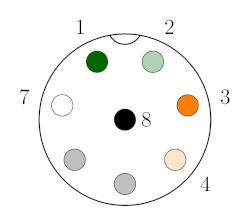

# Velodyne 3D lidar cabling guide

Author: [Tobit Flatscher](https://github.com/2b-t) (2023)

## Disclaimer

If you got yourself a lidar without the interface box - only with the **M12 connector** - you will have to make a cable for it yourself. Fortunately enough this can be done without any soldering. The **pin-out** for this can be found inside the [**offical data sheet**](https://pdf.directindustry.com/pdf/velodynelidar/vlp-16-datasheets/182407-676097.html).

At this point I want to make clear that this not the recommended way of interfacing the lidar, mainly for the following reasons:

- The sensor does not have **over-voltage** nor **reverse voltage protection** as stated [here](https://velodynelidar.com/wp-content/uploads/2019/08/63-9259-REV-C-MANUALINTERFACE-BOXHDL-32EVLP-16VLP-32_Web-S.pdf#page=2). The power regulation is generally performed by the interface box. This means if you follow this guide you have to be careful that you provide 12V DC without any drastic current spikes as any high current spikes (e.g. when mounting it onto a robot with other actuators) might damage the lidar. From my personal experience lidars can deal with slight overvoltages (e.g. 18V DC). If you want to be sure that your precious lidar is not damaged you could add a small standard board for power regulation (e.g. [this one](https://www.amazon.com/Regulator-Adjustable-Converter-Electronic-Stabilizer/dp/B07PDGG84B/)).
- The interface box allows you to use **GPS time sync** and sync the lidar to a GNSS receiver using pins 5 and 6 which I am not wiring in my guide but  in case you need them it should be quite straight forward to wire them  in: `GPS_RXD_CNT` should go to pin 5 while `GPS_PULSE_CNT` to pin 6 according to the [schematics in the manual](https://velodynelidar.com/wp-content/uploads/2019/12/63-9243-Rev-E-VLP-16-User-Manual.pdf#page=112) while you will have to provide the receiver with 5V and  ground.

So  if you need GPS sync or you can't provide a steady 12V DC voltage, either buy the interface box or make your own one starting from the [schematics in the manual](https://velodynelidar.com/wp-content/uploads/2019/12/63-9243-Rev-E-VLP-16-User-Manual.pdf#page=112). Furthermore I do not recommend following this guide if you plan on using the lidar in any commercial environment. 

## Creating your own cable

Get yourself a cheap 12V 1A power supply such as this [Zolt 45W](https://www.amazon.co.uk/dp/B08NBWHKGG?psc=1&ref=ppx_yo2ov_dt_b_product_details), a corresponding [pigtail power cable](https://www.amazon.co.uk/dp/B08JKQ3PF9?psc=1&ref=ppx_yo2ov_dt_b_product_details) (in this case positive center), an [Ethernet network cable](https://www.amazon.co.uk/gp/product/B00DZJNO4M/ref=ox_sc_saved_image_1?smid=A3GL1BA201XJVN&psc=1) and a [female 8-pin M12 connector](https://www.aliexpress.com/item/32839854023.html) (see pictures below).

|  |  |  |  |
| ------------------------------------------------------------ | ------------------------------------------------------------ | ------------------------------------------------------------ | ------------------------------------------------------------ |
| 12V 1A power supply                                          | Pigtail 5.5mm x 2.1mm power cable                            | Ethernet network cable                                       | Female 8-pin M12 connector                                   |

The Ethernet cable will likely be **T-568 B** (see image below):

The female 8-pin M12 connector should already be numbered on the front. In case it is not please check the [offical data sheet](https://pdf.directindustry.com/pdf/velodynelidar/vlp-16-datasheets/182407-676097.html) keeping in mind that the side depicted in the manual is the male sensor-side while you are interested in the matching (mirrored) female client-side which I sketched out below. In case you mess this up you might fatally damage your lidar!

You will have to connect the pins on the **computer-side** as follows:

| 8-pin connector pin number | Wire                         | Signal       |
| -------------------------- | ---------------------------- | ------------ |
| 1                          | Ethernet T-568B green        | Ethernet RX- |
| 2                          | Ethernet T-568B light-green  | Ethernet RX+ |
| 3                          | Ethernet T-568B orange       | Ethernet TX- |
| 4                          | Ethernet T-568B light-orange | Ethernet TX+ |
| 5                          | -                            | -            |
| 6                          | -                            | -            |
| 7                          | Power cable white            | +12V         |
| 8                          | Power cable black            | Ground       |

As described before GPS time sync should be using pins 5 and 6 as described above which I am not wiring in. I have no intention to sync my lidar to GPS in the near future and therefore did not test it. If you test it let me know and I will update this guide!

Before testing the cable with the lidar do yourself a favour and test the cable with a **multi-meter** and **test every single wire for continuity**.
